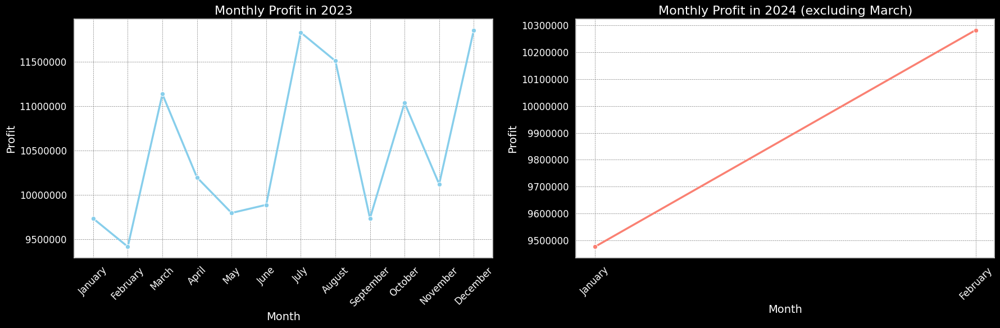
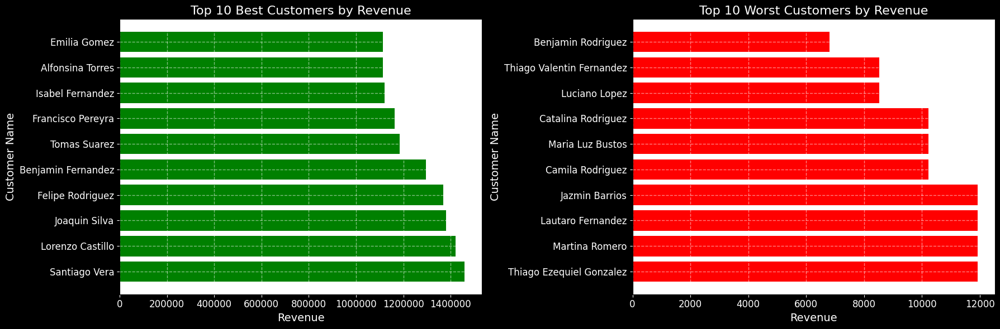
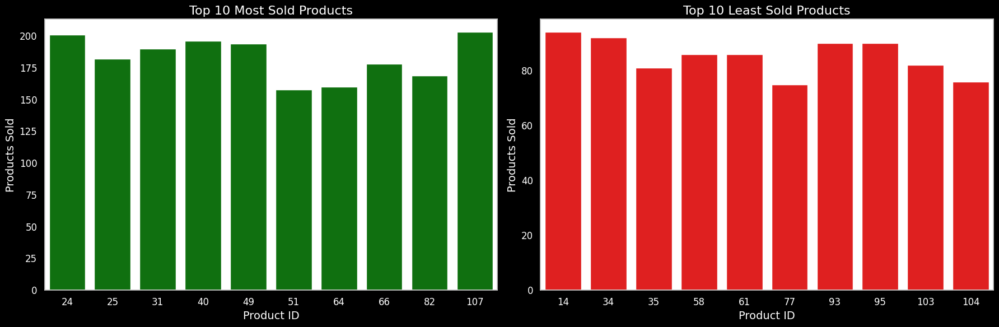

# Welcome to my ELT Pipeline for my Fake Bedsheets Store.

This guide outlines the steps to set up an ELT (Extract, Load, Transform) pipeline for the Fake Bedsheets Store. The pipeline extracts data from a PostgreSQL database, loads it into Google Cloud Storage (GCS) and BigQuery, and performs transformations using dbt (data build tool).

## Pre-requisites

Before starting the setup process, ensure you have the following:

- PostgreSQL database credentials
- Google Cloud Platform (GCP) service account JSON file
- Docker installed on your system
- Access to GCP and Airflow web interface

## Step-by-Step Setup

### 1. Database Configuration

On the`.env` fill the informatio with the PostgreSQL database configuration. Example:

```env
PROTOCOL_BUFFERS_PYTHON_IMPLEMENTATION=python # Dont touch this

DB_HOST=localhost
DB_NAME=bedsheets
DB_USER=postgres
DB_PASSWORD=postgres
DB_PORT=5432
```

### 2. Service Account Setup

Create a service account and place it in the folder /include/gcp-keys with the name service_account.json to establish a connection to your Google Cloud Platform (GCP) project.

### 3. Table Creation and Data Population

Run the bedsheets.py file located in the directory /include/bedsheets_app. This application is used to generate, create, and delete tables from the bedsheet store. Start with the Format option to create or clean up the tables. 
Following that, consider running the [Dummies] option, which populates the tables with random data generated by the Faker library. Alternatively, you can fill the tables with real data as needed.    

### 4. Setting Up Airflow

Run Astro dev start from the main folder to create Docker containers with Apache Airflow.

Once the process completes, navigate to the Airflow UI at http://localhost:8088. Go to Admin > Connections and create connections for your PostgreSQL and GCP. Name these connections postgres_default and gcp, respectively. Ensure you provide your personal arguments for these connections.

### 5. Running the DAG

With the setup complete, you're ready to run the bedsheets DAG. This DAG will perform the following tasks:

- Create a bucket in Google Cloud Storage (GCS) and populate it with the tables from the PostgreSQL database.
- Transfer these tables to BigQuery.
- Execute the dbt models.
- As a result, you will have two databases:
    - Raw_bedsheets: containing the tables from the PostgreSQL database.
    - bedsheets: containing all tables and views created by the dbt models, ready for insights.

Visualization Examples:

Below are some examples of visualizations created from the transformed tables using Seaborn and Pandas:








## Conclusion

In this guide, we have outlined the steps to set up an ELT pipeline for the Fake Bedsheets Store. By following these steps, you can efficiently extract data from a PostgreSQL database, load it into Google Cloud Storage (GCS) and BigQuery, and perform transformations using dbt (data build tool). With the pipeline in place, you can now analyze and derive insights from your data to make informed business decisions.

Thank you for reading!
